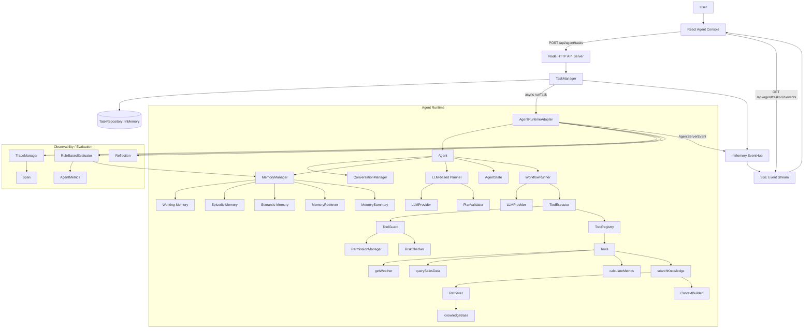

# TypeScript Agent Runtime Platform 技术审计报告

> 审计目标：基于当前真实代码，整理一份可用于 ChatGPT 展示、技术面试讲解、简历优化的 Agent Runtime Platform 项目评估资料。
>
> 审计结论：这是一个以学习和工程化演示为目标的纯 TypeScript Agent Runtime 平台，已经覆盖 Agent Runtime、LLM Provider、Function Calling、Workflow、RAG、Memory、Server SSE、React Console、Observability、Evaluation、Task Management、Tool Permission 和 Guardrails 等核心能力。当前更接近“企业级 Agent 平台原型 / MVP”，还不是生产级平台。

---

## 1. 最终项目目录结构

```text
project
├── Agent Runtime
│   ├── agent.ts
│   │   └── Agent 总入口；创建会话、写入用户消息、调用 Planner、PlanValidator、AgentState 和 WorkflowRunner，最终返回 AgentTrace。
│   ├── planner.ts
│   │   └── LLM-based Planner；将用户目标和 ToolDefinitions 发给 LLMProvider，解析结构化 Plan。
│   ├── plan-validator.ts
│   │   └── Plan 校验器；校验 goal、steps、tool 是否存在、args 是否匹配 Tool schema。
│   ├── state.ts
│   │   └── AgentState；保存 goal、steps、currentStep、completedStepIds、toolResults、error 和状态历史。
│   ├── workflow.ts
│   │   └── WorkflowRunner；按 PlanStep 顺序执行 Tool 或 LLM step，写入 Conversation、Memory、TraceStep，并 emit Runtime Event。
│   ├── executor.ts
│   │   └── ToolExecutor；执行 Tool，负责 ToolGuard 安全检查、参数校验、Timeout、错误归一化、ToolResult 返回。
│   ├── registry.ts
│   │   └── ToolRegistry；注册、查询、列出 Tool，并生成 OpenAI Function Calling 风格 ToolDefinition。
│   ├── tools.ts
│   │   └── 内置工具实现；包含 calculator、getWeather、slow_query、querySalesData、searchKnowledge、calculateMetrics。
│   ├── conversation.ts
│   │   └── ConversationManager；创建会话、保存结构化 Message、查询历史消息。
│   ├── event.ts
│   │   └── Runtime EventEmitter；分发 llm/tool/security/agent_finish 等 AgentEvent。
│   ├── types.ts
│   │   └── Runtime 核心类型；Message、ToolCall、ToolDefinition、ToolResult、Plan、Trace、AgentEvent。
│   └── main.ts
│       └── 本地 Demo 入口；用于命令行演示 Runtime 能力和事件输出。
│
├── LLM Provider
│   └── src/llm
│       ├── provider.ts
│       │   └── LLMProvider 抽象接口；定义 chat(messages, tools?)。
│       ├── mock-llm-provider.ts
│       │   └── MockLLMProvider；支持 Planner 场景和预置 LLMResponse，便于离线测试。
│       ├── openai-provider.ts
│       │   └── OpenAI Compatible Provider；调用 /chat/completions，支持 messages、tools、tool_choice、temperature。
│       └── index.ts
│           └── LLM Provider 统一导出。
│
├── RAG System
│   └── src/knowledge
│       ├── document.ts
│       │   └── Document / RetrievedDocument 类型定义。
│       ├── knowledge-base.ts
│       │   └── KnowledgeBase；内存知识文档存储，支持 addDocument/listDocuments。
│       ├── retriever.ts
│       │   └── Retriever；基于关键词匹配模拟向量检索，返回 TopK RetrievedDocument。
│       ├── context-builder.ts
│       │   └── ContextBuilder；将检索文档拼装成 LLM 可读上下文。
│       └── index.ts
│           └── RAG 模块统一导出。
│
├── Memory System
│   └── memory
│       ├── memory-types.ts
│       │   └── MemoryType、MemoryItem、MemoryQuery、MemoryStore 等统一类型。
│       ├── memory-manager.ts
│       │   └── MemoryManager 门面；整合 working/episodic/semantic memory、retriever、updater、summary。
│       ├── working-memory.ts
│       │   └── WorkingMemory；保存当前任务上下文，任务开始时清理旧 working memory。
│       ├── episodic-memory.ts
│       │   └── EpisodicMemory；保存任务经历、工具结果、最终回答、评估摘要。
│       ├── semantic-memory.ts
│       │   └── SemanticMemory；保存用户背景、偏好和可复用长期知识，支持同内容合并。
│       ├── memory-retriever.ts
│       │   └── MemoryRetriever；关键词 + importance 评分检索相关记忆。
│       ├── memory-updater.ts
│       │   └── MemoryUpdater；从用户输入、工具结果、最终回答生成 MemoryItem。
│       └── memory-summary.ts
│           └── MemorySummary；将检索到的记忆整理为系统上下文。
│
├── Security / Reliability
│   └── security
│       ├── permission-types.ts
│       │   └── UserContext、ToolPermission、ToolRiskLevel、ApprovalStatus、安全事件类型。
│       ├── permission-manager.ts
│       │   └── PermissionManager；基于 role 的工具权限矩阵。
│       ├── risk-checker.ts
│       │   └── RiskChecker；高风险 Tool 触发 pending_approval。
│       ├── tool-guard.ts
│       │   └── ToolGuard；统一检查权限、策略允许性和风险审批状态。
│       └── reliability-test.ts
│           └── Day9-1 测试；覆盖 viewer 权限拒绝、analyst 成功、高风险审批。
│
├── Observability
│   └── observability
│       ├── trace-types.ts
│       │   └── TraceRecord、SpanRecord、EvaluationContext、EvaluationResult 等观测类型。
│       ├── span.ts
│       │   └── Span；记录组件级开始、结束、耗时、状态、metadata。
│       ├── trace-manager.ts
│       │   └── TraceManager；创建 Trace、记录 Span、结束 Trace、查询 Trace。
│       ├── metrics.ts
│       │   └── AgentMetrics；统计 taskCount、successCount、failedCount、avgDuration、toolErrorCount、evaluationScore。
│       └── evaluator.ts
│           └── RuleBasedEvaluator；基于完整性、准确性、groundedness、任务完成度给最终回答评分。
│
├── Server Layer
│   └── server
│       ├── index.ts
│       │   └── Server 启动入口；创建 AgentRuntimeAdapter 并监听 3001 端口。
│       ├── app.ts
│       │   └── 组装 Server App；创建 TaskManager、TaskRepository、EventHub。
│       ├── http.ts
│       │   └── Node.js 原生 HTTP Server；路由匹配、JSON body 解析、CORS、SSE 响应。
│       ├── routes
│       │   └── agent.ts
│       │       └── Agent API Handler；创建任务、取消、重试、查询状态、查询历史、订阅事件。
│       ├── runtime
│       │   └── agent-runtime-adapter.ts
│       │       └── Runtime Adapter；将 Agent Runtime 适配为 Server RuntimePort，转换 AgentEvent 为 AgentServerEvent。
│       ├── sse
│       │   └── event-stream.ts
│       │       └── SSE 序列化；支持 event/id/data、heartbeat、close。
│       ├── task
│       │   ├── task-types.ts
│       │   │   └── TaskRecord、TaskStatus、TaskRuntimeHandle、Create/UpdateTaskInput。
│       │   ├── task-repository.ts
│       │   │   └── TaskRepository 抽象；为 Redis/Postgres 预留替换点。
│       │   ├── task-store.ts
│       │   │   └── InMemoryTaskRepository；内存任务存储。
│       │   └── task-manager.ts
│       │       └── TaskManager；创建、启动、取消、重试、失败、完成任务并更新状态。
│       └── types
│           └── api.ts
│               └── API Contract；AgentServerEvent、payload、request/response、RuntimeTaskContext。
│
├── React Console
│   └── agent-console
│       ├── package.json
│       │   └── React 18 + Vite + TypeScript + Zustand + Tailwind + Vitest 工程配置。
│       ├── .env
│       │   └── VITE_AGENT_SERVER_URL=http://127.0.0.1:3001。
│       ├── vite.config.ts
│       │   └── Vite 构建配置。
│       ├── vitest.config.ts
│       │   └── Vitest 测试配置。
│       ├── eslint.config.js
│       │   └── ESLint 规则配置。
│       ├── tailwind.config.ts
│       │   └── Tailwind 主题配置。
│       └── src
│           ├── main.tsx
│           │   └── React 应用入口。
│           ├── router/index.ts
│           │   └── React Router 配置。
│           ├── styles.css
│           │   └── Tailwind 基础样式和 Console UI 全局样式。
│           ├── pages/AgentConsole.tsx
│           │   └── 三栏 Agent Console 页面；Chat、Execution、Knowledge/Memory/Evaluation/Citation。
│           ├── api/agent.ts
│           │   └── createAgentTask + EventSource SSE 订阅。
│           ├── api/agent.test.ts
│           │   └── 前端 API / EventSource mock 测试。
│           ├── hooks/useAgentStream.ts
│           │   └── 封装创建任务和 SSE 生命周期。
│           ├── store/agentStore.ts
│           │   └── Zustand Store；消费 AgentEvent 并更新 message、plan、tools、citations、memory、state、evaluation。
│           ├── types/agent.ts
│           │   └── 前端 AgentEvent、Message、Plan、ToolCallRecord、MemoryRecord、EvaluationResult 类型。
│           ├── components/chat
│           │   ├── ChatPanel.tsx
│           │   │   └── Chat 区容器；消息列表和输入框。
│           │   ├── MessageItem.tsx
│           │   │   └── Markdown 消息渲染。
│           │   └── InputBox.tsx
│           │       └── 用户输入和发送任务。
│           └── components/agent
│               ├── PlanViewer.tsx
│               │   └── 展示 Planner 生成的任务计划。
│               ├── ExecutionTimeline.tsx
│               │   └── 展示 AgentEvent 时间线，包括 planner/tool/rag/reflection/memory/evaluation/guardrail。
│               ├── ToolInspector.tsx
│               │   └── 展示工具调用参数、结果、状态、耗时。
│               ├── KnowledgePanel.tsx
│               │   └── 展示 RAG 检索内容。
│               ├── CitationPanel.tsx
│               │   └── 展示知识来源、chunk、score。
│               ├── MemoryPanel.tsx
│               │   └── 展示 working/episodic/semantic memory。
│               ├── StateViewer.tsx
│               │   └── 展示 AgentState 快照。
│               └── EvaluationPanel.tsx
│                   └── 展示评估 score、criteria、feedback。
│
├── Configuration
│   ├── package.json
│   │   └── 根项目脚本；server/typecheck/test。
│   ├── package-lock.json
│   │   └── 根项目依赖锁定。
│   ├── tsconfig.json
│   │   └── 根 TypeScript strict 配置。
│   ├── .gitignore
│   │   └── Git 忽略规则；应确保 node_modules/dist 不上传。
│   └── agent-console 配置文件
│       └── Vite、Vitest、ESLint、Prettier、Tailwind、TSConfig。
│
└── Test
    ├── security/reliability-test.ts
    │   └── Runtime 可靠性测试，覆盖 Tool Permission 和高风险 approval。
    └── agent-console/src/api/agent.test.ts
        └── React Console SSE / final_answer store 更新测试。
```

说明：`node_modules`、`agent-console/node_modules`、`agent-console/dist` 属于依赖或构建产物，不应作为项目源码上传或展示。

---

## 2. 当前系统整体架构图



ASCII 视角：

```text
User
 |
 v
React Agent Console
 |  POST task / SSE subscribe
 v
Node HTTP API Server
 |
 v
TaskManager
 |-- TaskRepository(InMemory)
 |-- EventHub(InMemory)
 |
 v
AgentRuntimeAdapter
 |
 v
Agent
 |-- ConversationManager
 |-- MemoryManager
 |-- Planner -> LLMProvider
 |-- PlanValidator
 |-- AgentState
 |-- WorkflowRunner
       |-- LLMProvider
       |-- ToolExecutor
             |-- ToolGuard -> PermissionManager / RiskChecker
             |-- ToolRegistry
             |-- Tools
                   |-- searchKnowledge -> Retriever -> KnowledgeBase -> ContextBuilder
 |
 v
TraceManager / Evaluator / Metrics / Reflection
 |
 v
AgentServerEvent -> SSE -> React Console Panels
```

---

## 3. Agent 完整执行流程

示例任务：

```text
分析华东区域销售下降原因，并生成报告
```

### Step 1：用户输入如何进入系统

1. 用户在 React Console 的 `ChatPanel/InputBox` 输入任务。
2. `useAgentStream.start(input)` 被触发。
3. `agentStore.beginTask(input)` 先在前端追加 user message 和空 assistant message。
4. `createAgentTask(input)` 调用：

```http
POST /api/agent/tasks
{
  "input": "分析华东区域销售下降原因，并生成报告"
}
```

5. Server 的 `http.ts` 解析 JSON body，调用 `routes/agent.ts` 的 `createTask()`。
6. `TaskManager.createTask()` 创建 `TaskRecord`，状态为 `queued`，并发布 `task_created`。
7. `TaskManager.startTask(taskId)` 将任务置为 `running`，异步调用 `AgentRuntimeAdapter.runTask()`。
8. 前端拿到 `taskId` 后，使用 `EventSource` 连接：

```http
GET /api/agent/tasks/:taskId/events
```

后续所有 Runtime 事件通过 SSE 推送到 Console。

### Step 2：Planner 如何生成 Plan

1. `AgentRuntimeAdapter` 先 emit `plan_start`，同时创建 Observability Trace。
2. `Agent.run(userInput)` 创建 Conversation，并写入用户 Message。
3. `MemoryManager.recordUserInput()` 写入：
   - working memory：当前目标
   - episodic memory：用户发起任务
   - 如果是用户画像表达，则额外写 semantic memory
4. `Planner.createPlan(userInput)` 获取 `ToolRegistry.getToolDefinitions()`。
5. Planner 构造两条 ChatMessage：
   - system：要求 LLM 扮演任务规划器，只返回 JSON
   - user：包含 goal 和 tools
6. `LLMProvider.chat(messages)` 返回 JSON Plan。
7. `MockLLMProvider` 对“销售下降”场景返回固定计划：

```json
{
  "goal": "分析华东区域销售下降原因，并生成报告",
  "steps": [
    {
      "id": "1",
      "tool": "querySalesData",
      "description": "查询华东区域销售数据",
      "args": { "region": "华东", "month": "2024-02" }
    },
    {
      "id": "2",
      "tool": "calculateMetrics",
      "description": "计算华东区域销售增长率",
      "args": { "current": 980000, "previous": 1250000, "metric": "growth" }
    },
    {
      "id": "3",
      "tool": "searchKnowledge",
      "description": "检索华东销售下降的可能原因",
      "args": { "query": "华东 销售下降 渠道 原因", "limit": 3 }
    },
    {
      "id": "4",
      "tool": "llm",
      "description": "根据销售数据、增长率和知识库结果生成分析报告"
    }
  ]
}
```

8. `ServerEventPlanner` 拦截 plan 生成结果，向前端 emit `plan_update`。

### Step 3：State 如何保存任务状态

1. `Agent` 使用 Plan 创建 `new AgentState(plan)`。
2. `AgentState` 保存：
   - goal
   - steps
   - currentStepId
   - completedStepIds
   - status
   - toolResults
   - error
   - history
3. 每次 `updateStep()`、`addToolResult()`、`markCompleted()`、`markFailed()` 都会调用 `capture()` 保存快照。
4. `AgentRuntimeAdapter` 在任务结束后遍历 `trace.stateHistory`，转成 `state_update` SSE 事件。
5. React Console 的 `StateViewer` 展示当前状态。

### Step 4：WorkflowRunner 如何执行

1. `WorkflowRunner.run()` 从 `AgentState.getSteps()` 获取 PlanStep。
2. 按顺序执行每个 step。
3. 对普通工具 step：
   - 创建 assistant message，附带 toolCalls
   - 调用 `runToolStep()`
4. 对 `tool === "llm"` 的 step：
   - 调用 `runLLMStep()`
   - 读取 Conversation 历史和 MemoryContext
   - 调用 `LLMProvider.chat(llmMessages, toolDefinitions)`
   - 如果没有 toolCalls，则保存最终 assistant message
5. 每个 Workflow step 都会写入 `WorkflowTraceStep`，包含 startedAt、endedAt、duration、traceSteps、error。

### Step 5：Tool 调用流程

1. `WorkflowRunner.runToolStep()` emit `tool_start`。
2. `ToolExecutor.run(toolName, args)` 开始执行。
3. Executor 先从 `ToolRegistry.get(name)` 查找工具。
4. 找不到工具时返回失败 ToolResult。
5. 找到工具后进入 `ToolGuard.check()`：
   - `PermissionManager` 判断当前 role 是否允许调用该 tool
   - `RiskChecker` 判断 high risk tool 是否需要 approval
6. Guard 失败时，不执行真实 tool，直接返回失败 ToolResult，并附带：
   - `security.eventType`
   - `approvalStatus`
   - `risk`
   - `userContext`
7. Guard 通过后，Executor 校验 argsSchema。
8. Executor 使用 `Promise.race()` 实现 Timeout。
9. Tool 返回统一 `ToolResult`：

```ts
{
  success: boolean;
  toolName: string;
  data?: unknown;
  error?: string;
  duration: number;
}
```

10. Workflow 根据 ToolResult emit：
   - success：`tool_success`
   - error：`tool_error`
   - security：额外 emit `permission_denied` / `tool_blocked` / `approval_required`
11. ToolResult 写入 Conversation 的 role=tool message。
12. ToolResult 写入 Memory。

### Step 6：RAG 检索流程

1. Planner 生成 `searchKnowledge` step。
2. Workflow 调用 ToolExecutor 执行 `searchKnowledge`。
3. `searchKnowledge Tool` 不直接访问 KnowledgeBase，而是使用注入的：
   - `Retriever`
   - `ContextBuilder`
4. `Retriever.retrieve(query, topK)`：
   - 从 KnowledgeBase listDocuments
   - 关键词 tokenize
   - 按 matchedKeywords 计算 score
   - 排序并返回 TopK
5. `ContextBuilder.build(query, documents)`：
   - 将文档拼成 `[1] title\ncontent` 格式上下文
   - 返回 context、documents、documentCount
6. ToolResult.data 包含：
   - query
   - context
   - documents
   - documentCount
   - retrievalDuration
   - logs
7. `AgentRuntimeAdapter.toRagRetrievePayload()` 识别 searchKnowledge 结果并 emit `rag_retrieve`。
8. React Console：
   - `KnowledgePanel` 展示检索内容
   - `CitationPanel` 展示来源、chunk、score

### Step 7：Memory 读写流程

写入：

1. 用户输入阶段：`MemoryManager.recordUserInput()`
2. 工具执行后：`MemoryManager.recordToolResult()`
3. 最终回答后：`MemoryManager.recordFinalAnswer()`
4. Evaluation 后：`AgentRuntimeAdapter` 额外写 episodic memory，保存评分和反馈

读取：

1. `WorkflowRunner.buildLLMMessages()` 在每个 LLM step 前调用：

```ts
memoryManager.buildContext(`${userInput} ${stepDescription}`)
```

2. `MemoryRetriever` 使用关键词 + importance 检索 working/episodic/semantic memory。
3. `MemorySummary` 生成系统上下文：

```text
相关长期记忆：
1. [working] importance=...
...
使用这些记忆辅助判断，但不要编造记忆中不存在的事实。
```

### Step 8：Reflection 如何检查结果

当前 Reflection 是轻量实现，主要位于 `AgentRuntimeAdapter` 中：

1. Workflow 完成并生成 finalAnswer。
2. Evaluation 执行后得到 score 和 feedback。
3. Adapter emit `reflection`：
   - 如果 `trace.success && evaluation.score >= 0.7`，状态为 `passed`
   - 否则为 `needs_replanning`
4. 当前项目已有 replanning 事件类型和基础结构，但尚未实现真正的自动重规划循环。

### Step 9：Evaluation 如何评分

1. Adapter emit `evaluation_start`。
2. 构造 `EvaluationContext`：
   - taskId
   - input
   - finalAnswer
   - toolResults
   - ragDocuments
   - observability trace
3. `RuleBasedEvaluator.evaluate()` 计算：
   - completeness：是否有结构化回答、长度足够、工具成功
   - accuracy：工具失败越多，分数越低
   - groundedness：是否有 RAG documents
   - taskCompletion：是否有 finalAnswer 且无工具失败
4. 输出：

```ts
{
  score: number;
  criteria: {
    completeness: number;
    accuracy: number;
    groundedness: number;
    taskCompletion: number;
  };
  feedback: string[];
}
```

5. Adapter emit `evaluation_complete`。
6. Evaluation 结果写入 Memory。
7. Console `EvaluationPanel` 展示 score、criteria、feedback。

### Step 10：Final Answer 如何返回前端

1. LLM step 生成最终回答后，Workflow 保存 assistant message。
2. Adapter 监听 `llm_response`，如果 `done=true` 且有 content，则调用 `streamFinalAnswer()`。
3. `streamFinalAnswer()` 将回答拆成小 delta，连续 emit `final_answer`。
4. Adapter 最后 emit 一次：

```ts
{
  type: "final_answer",
  payload: {
    content: trace.finalAnswer,
    done: true
  }
}
```

5. TaskManager 根据事件推进进度，最终 emit `task_complete`。
6. React Console：
   - `agentStore.applyFinalAnswer()` 将 delta 累加到 `answerBuffer`
   - 更新 active assistant message
   - `MessageItem` 使用 React Markdown 渲染最终报告

---

## 4. 模块职责说明表

| 模块 | 英文名称 | 职责 | 解决的问题 | 面试表达 |
|---|---|---|---|---|
| Agent | Agent Runtime Orchestrator | 编排 Conversation、Planner、Validator、State、Workflow、Memory，并输出 AgentTrace | 避免业务代码直接串 LLM/Tool，形成统一 Runtime 入口 | 我把 Agent 设计成运行时编排器，不直接耦合具体 Tool 或模型，只负责生命周期和状态流转 |
| LLMProvider | LLM Provider Abstraction | 抽象 chat(messages, tools?)，支持 Mock 和 OpenAI Compatible API | 隔离模型供应商差异，便于本地测试和真实模型切换 | Agent 只依赖 LLMProvider 接口，Provider 负责协议适配 |
| Planner | LLM-based Planner | 根据用户目标和 ToolDefinitions 生成结构化 Plan | 从简单 Agent Loop 升级为目标驱动 Workflow | Planner 通过工具 schema 让 LLM 先规划，再由 Runtime 校验和执行 |
| PlanValidator | Plan Validator | 校验 Plan 格式、工具存在性、参数 schema | 防止 LLM 生成不可执行计划 | LLM 产物不能直接信任，必须经过结构化验证 |
| State | Agent State | 保存 goal、steps、currentStep、completedStepIds、toolResults、history | 让 Agent 执行过程可追踪、可恢复、可展示 | State 是企业 Agent 的执行状态机基础 |
| WorkflowRunner | Workflow Runner | 按 PlanStep 顺序执行 LLM/Tool，生成 WorkflowTrace | 将计划变成可控执行链路 | WorkflowRunner 把 Agent 从“循环调用工具”升级为“状态化工作流” |
| ToolExecutor | Tool Runtime Executor | 统一执行工具、参数校验、Timeout、安全检查、结果归一化 | 避免每个工具自己处理错误和超时 | ToolExecutor 是工具运行时边界，集中做权限、参数、超时和错误治理 |
| ToolRegistry | Tool Registry | 注册 Tool，生成 ToolDefinition | 管理工具发现和 Function Calling schema | ToolRegistry 是 LLM 与本地工具之间的能力目录 |
| Tool | Function Tool | 具体能力实现，如天气、销售查询、指标计算、知识检索 | 将外部能力封装成可被 Agent 调用的函数 | 每个 Tool 都有 description、argsSchema、risk 和 execute |
| RAG | Retrieval-Augmented Generation | 通过 searchKnowledge 工具检索知识并构造上下文 | 让回答有知识依据，减少纯模型幻觉 | 当前是轻量 RAG 数据流模拟，保留真实向量库接入点 |
| Retriever | Retriever | 根据 query 检索 TopK 文档 | 从 KnowledgeBase 找到相关知识 | 目前用关键词评分模拟向量检索 |
| Vector Database | Vector Store / Vector Database | 当前未接入真实向量库，由 KnowledgeBase + Retriever 模拟 | 未来解决大规模语义检索、召回、过滤和持久化 | 这个项目预留了 Retriever 抽象，后续可替换为 pgvector、Milvus、Qdrant、Pinecone |
| Context Builder | Context Builder | 将检索结果整理成 LLM 可读上下文 | 避免直接把原始文档丢给模型 | ContextBuilder 负责 RAG 结果压缩和格式化 |
| Memory | Memory Manager | 管理 working/episodic/semantic memory 的写入、检索、摘要 | 让 Agent 具备跨任务上下文和用户偏好记忆 | MemoryManager 是长期记忆门面，屏蔽不同 memory store |
| Working Memory | Working Memory | 保存当前任务目标和临时工具结果 | 支撑单次任务上下文 | Working Memory 类似 Agent 的短期工作台 |
| Episodic Memory | Episodic Memory | 保存用户发起任务、工具结果、最终回答、评估记录 | 支撑历史任务复盘 | Episodic Memory 记录“发生过什么” |
| Semantic Memory | Semantic Memory | 保存用户画像、偏好、可复用知识 | 支撑个性化和长期偏好 | Semantic Memory 记录“长期稳定事实” |
| Reflection | Reflection | 基于执行结果和 evaluation 判断是否通过 | 让 Agent 具备自检能力 | 当前 Reflection 是规则化检查，后续可扩展为 LLM judge 和自动修正 |
| Replanning | Replanning | 当前已有事件和基础概念，未实现完整自动重规划 | 为失败恢复和计划修正预留空间 | 项目已具备重规划接口意识，但还需要真正的反馈闭环 |
| Evaluation | Evaluation / Evaluator | 对最终回答按 completeness、accuracy、groundedness、taskCompletion 评分 | 量化 Agent 输出质量 | Evaluation 把 Agent 从“能跑”升级到“可评估” |
| Trace | Trace / Span | 记录 task、component、duration、status、metadata | 支撑性能分析和问题定位 | TraceManager 对 Planner、Workflow、Tool、LLM、RAG、Memory、Reflection、Evaluator 打点 |
| Observability | Observability Layer | Trace + Metrics + Event，覆盖任务耗时、成功率、工具错误、评分 | 让 Agent 执行链路可观测 | Observability 是 Agent 平台生产化的关键能力 |
| SSE | Server-Sent Events | 将 AgentServerEvent 实时推送到前端 | 解决 Agent 长任务过程可视化 | SSE 比一次性 HTTP response 更适合展示 Agent 执行过程 |

---

## 5. 当前项目技术能力评估

满分 100。评分以“AI Agent 应用开发岗位 / 前端 AI 平台岗位 / Web AI 平台开发岗位”的招聘视角衡量。

### Agent Architecture：82 / 100

- 当前评分：82
- 原因：
  - 有独立 Agent、Planner、WorkflowRunner、State、Trace、Memory、Tool Runtime。
  - 架构模块边界清晰，没有引入 LangChain，能体现自研 Runtime 思路。
  - 支持 LLM-based Planner 和 Function Calling 风格 Tool Schema。
- 缺失能力：
  - 缺少真正的并发 step / DAG workflow。
  - Replanning 仍是概念和事件，未形成自动重规划闭环。
  - AgentTrace 和 Observability Trace 还未完全统一成一个标准 trace model。

### LLM Integration：74 / 100

- 当前评分：74
- 原因：
  - 有 LLMProvider 抽象，支持 Mock 和 OpenAI Compatible API。
  - OpenAIProvider 支持 messages、tools、tool_choice、temperature。
  - Provider 层能屏蔽 risk 元数据，避免污染 OpenAI tools schema。
- 缺失能力：
  - 没有 streaming token 级真实模型输出，目前 final answer 是服务端拆分模拟。
  - 没有 retry/backoff、rate limit、model fallback。
  - 没有 provider response usage/token/cost 统计。

### Tool Runtime：83 / 100

- 当前评分：83
- 原因：
  - ToolRegistry、ToolExecutor、ToolDefinition、ToolResult 结构完整。
  - 支持参数校验、Timeout、Tool Not Found、Tool Execution Error。
  - 新增 ToolGuard 支持权限、风险等级、高风险 approval pending。
- 缺失能力：
  - 缺少真实异步 approval flow，例如人工审批后 resume task。
  - 缺少工具幂等、重试策略、工具 side-effect 分类。
  - 工具 schema 还比较简化，只支持 string/number/boolean。

### RAG：65 / 100

- 当前评分：65
- 原因：
  - 已具备 KnowledgeBase、Retriever、ContextBuilder 和 searchKnowledge Tool 数据流。
  - Tool 不直接访问 KnowledgeBase，模块解耦较好。
  - Trace/SSE 中可展示 RAG retrievalDuration、documentCount、citations。
- 缺失能力：
  - 没有 Embedding。
  - 没有真实 Vector Database。
  - 没有 chunking、rerank、metadata filter、citation grounding check。
  - 没有文档 ingestion pipeline。

### Memory：72 / 100

- 当前评分：72
- 原因：
  - 有 working、episodic、semantic 三类 Memory。
  - 有 MemoryRetriever、MemoryUpdater、MemorySummary。
  - 能从用户输入、工具结果、最终回答、Evaluation 写记忆。
- 缺失能力：
  - Memory 全部内存存储，缺少持久化。
  - 没有用户级隔离和 tenant 隔离。
  - 语义记忆仍基于规则和关键词，缺少 embedding-based memory retrieval。
  - 没有 memory decay、conflict resolution、privacy deletion。

### Workflow：78 / 100

- 当前评分：78
- 原因：
  - 有 PlanStep 顺序执行，WorkflowTrace，StateHistory。
  - Tool step 和 LLM step 区分清楚。
  - Server TaskManager 支持 queued/running/completed/failed/cancelled。
- 缺失能力：
  - Workflow 是线性流程，不支持 DAG、条件分支、循环、并发。
  - cancel 使用 AbortController，但工具执行中断仍依赖工具自身是否响应 abort。
  - retry 是任务级 retry，不是 step 级 retry。

### Reliability：76 / 100

- 当前评分：76
- 原因：
  - 支持 Timeout、Tool error、权限拒绝、工具阻断、高风险 approval_required。
  - TaskManager 支持 cancel/retry。
  - PlanValidator 防止 LLM 输出非法工具调用。
- 缺失能力：
  - 高风险 approval 目前只返回 pending_approval，没有审批 API 和 resume workflow。
  - 缺少 prompt injection 防护、输出合规检查、敏感数据脱敏。
  - 缺少 circuit breaker、quota、tenant rate limit。

### Observability：80 / 100

- 当前评分：80
- 原因：
  - 有 TraceManager、Span、Metrics、Evaluation。
  - 覆盖 Planner、WorkflowRunner、ToolExecutor、LLMProvider、RAG、Memory、Reflection、Evaluator。
  - React Console 能展示 Timeline、Tool、State、Knowledge、Memory、Evaluation。
- 缺失能力：
  - Trace 还没有持久化和查询 API。
  - 没有 OpenTelemetry 标准导出。
  - Metrics 只在内存中，缺少 dashboard API 和聚合窗口。

### Frontend Console：82 / 100

- 当前评分：82
- 原因：
  - 不是普通 Chat 页面，而是三栏 Agent Console。
  - 展示 Chat、Plan、Timeline、Tool、Knowledge、Memory、Citation、State、Evaluation。
  - Zustand 集中消费 SSE 事件，UI 组件职责清晰。
- 缺失能力：
  - 缺少任务列表、历史任务回放、Trace 详情页。
  - 缺少 approval 操作 UI。
  - 缺少错误恢复、取消/重试按钮接入。

### Engineering Quality：77 / 100

- 当前评分：77
- 原因：
  - TypeScript strict。
  - 模块边界清楚。
  - 前端有 ESLint、Prettier、Vitest、Build。
  - 根项目有 typecheck 和 Reliability test。
- 缺失能力：
  - 后端测试覆盖不足，主要是脚本式测试。
  - 缺少 CI。
  - 缺少 API schema 自动生成、契约测试。
  - 部分概念偏 Demo，例如 Mock 数据、内存存储、规则评估。

### 综合评分：77.9 / 100

招聘视角定位：

- 对 AI Agent 应用开发工程师：有较强展示价值。
- 对前端 AI 工程师：非常适合展示“Agent Console + SSE + 状态可视化”能力。
- 对平台工程 / 后端 Agent Runtime 岗位：是不错原型，但还需要补持久化、队列、真实 RAG、审批流、生产监控。

---

## 6. 简历项目描述生成

### 中文简历版本

**项目名称：TypeScript Agent Runtime Platform / 企业级 Agent 可视化控制台**

**技术栈：**

TypeScript、Node.js 原生 HTTP Server、React 18、Vite、Zustand、TailwindCSS、React Markdown、SSE、OpenAI Compatible API、Vitest、ESLint、Prettier

**项目描述：**

从零实现一个纯 TypeScript AI Agent Runtime Platform，覆盖 Agent 任务规划、Function Calling、Tool Runtime、RAG、Memory、Workflow State、Task Management、SSE 实时事件流、Observability、Evaluation、Tool Permission 与 Guardrails，并配套实现 React Agent Console，用于可视化展示 Chat、Plan、Timeline、Tool 调用、RAG 来源、Memory 更新、Agent State 和 Evaluation 结果。项目不依赖 LangChain，重点模拟企业级 AI 应用接入真实 Agent Runtime 的完整工程链路。

**核心贡献：**

- 设计并实现 LLMProvider 抽象层，支持 MockLLMProvider 与 OpenAI Compatible Provider，Agent Runtime 与具体模型供应商解耦。
- 将 Agent 从简单 Tool Loop 升级为 Planner + PlanValidator + AgentState + WorkflowRunner 的状态化执行架构。
- 规范化 Function Calling 协议，实现 ToolDefinition、ToolCall、ToolResult、ToolRegistry、ToolExecutor，支持参数校验、Timeout、工具不存在、执行失败等异常治理。
- 实现轻量 RAG 数据流，包括 KnowledgeBase、Retriever、ContextBuilder，并通过 searchKnowledge Tool 将检索结果接入 Agent Workflow。
- 实现长期记忆系统，支持 Working / Episodic / Semantic Memory，以及基于关键词和 importance 的 MemoryRetriever。
- 基于 Node.js 原生 HTTP Server 实现 Agent Server，提供任务创建、状态查询、取消、重试和 SSE 实时事件订阅接口。
- 构建 React Agent Console，使用 Zustand 消费 SSE 事件，实时展示 Plan、Timeline、Tool、Knowledge、Memory、Citation、State、Evaluation。
- 增加 Observability 和 Evaluation 能力，通过 Trace/Span/Metrics 记录 Planner、Workflow、Tool、LLM、RAG、Memory、Evaluator 等组件耗时与状态。
- 增加 Tool Permission + Guardrails，支持 UserContext、role-based permission、tool risk level、高风险工具 pending approval 和安全事件推送。

### 适合岗位表达

**AI Agent 应用开发工程师：**

该项目体现了从 Agent Runtime、Function Calling、RAG、Memory、Workflow 到 Evaluation 的完整应用工程能力，能够说明候选人不仅会调用模型 API，也理解 Agent 应用生产化所需的状态、工具、安全和观测能力。

**前端 AI 工程师：**

该项目亮点在于不是普通 Chat UI，而是 Agent Console，通过 SSE 实时消费 Runtime 事件，将 Agent 的 Plan、Tool、RAG、Memory、State、Evaluation 过程可视化，适合展示 AI Native 前端平台能力。

**Web AI 平台开发：**

该项目具备 Runtime / Server / Console 分层，包含 TaskManager、API Contract、SSE、Trace、Evaluation、Guardrails 等平台化模块，适合作为 AI Agent 平台原型项目。

---

## 7. 面试讲解版本：3 分钟项目介绍

### 1. 项目背景

这个项目是我用纯 TypeScript 从零实现的一个 Agent Runtime Platform。目标不是简单做一个 Chat 页面，而是模拟企业里真实 AI 应用如何接入 Agent Runtime：前端能实时看到 Agent 的计划、工具调用、RAG 检索、Memory 更新、状态变化、评估结果和安全拦截。

### 2. 为什么设计 Agent Runtime

如果只是在业务代码里直接调用 LLM API，很快会遇到几个问题：工具怎么注册和校验、LLM 生成的工具调用是否可信、任务执行状态如何保存、长任务如何实时返回前端、失败如何追踪、回答质量如何评估。所以我把它抽象成 Agent Runtime，由 Agent 统一编排 Planner、PlanValidator、State、WorkflowRunner、ToolExecutor、Memory 和 Observability。

### 3. 核心架构

整体分为三层：

第一层是 React Agent Console，负责 Chat 输入和 Agent 执行过程可视化。

第二层是 Node.js 原生 HTTP Server，提供任务创建、状态查询、取消、重试和 SSE 事件流。

第三层是 Agent Runtime，内部包含 LLMProvider、Planner、WorkflowRunner、ToolRegistry、ToolExecutor、RAG、Memory、Evaluation、Trace 和 Guardrails。

用户输入后，Server 创建 Task，TaskManager 异步调用 AgentRuntimeAdapter，Adapter 再启动 Agent。Agent 先让 Planner 根据用户目标和工具 schema 生成 Plan，再由 PlanValidator 校验，随后 WorkflowRunner 按步骤执行 Tool 或 LLM。每一步都会产出事件，通过 SSE 推给前端。

### 4. 关键技术点

第一个关键点是 LLMProvider 抽象，我实现了 MockLLMProvider 和 OpenAI Compatible Provider，Agent 不直接依赖某个模型厂商。

第二个是 Function Calling 规范化，ToolRegistry 能输出类似 OpenAI tools 的 schema，ToolCall 有 id，ToolResult 有统一结构，便于关联 assistant tool_call 和 tool result。

第三个是状态化 Workflow。AgentState 会记录当前 step、已完成 step、工具结果和历史快照，前端可以实时展示执行状态。

第四个是 RAG 和 Memory。RAG 目前用关键词检索模拟向量检索，但完整保留了 KnowledgeBase、Retriever、ContextBuilder 的数据流。Memory 分成 working、episodic、semantic 三类，能把用户输入、工具结果、最终回答和评估结果写入长期记忆。

第五个是 Observability 和 Evaluation。我设计了 TraceManager、Span、Metrics 和 Evaluator，能记录 Planner、Tool、LLM、RAG、Memory、Evaluator 等组件的耗时和状态，并对最终回答按完整性、准确性、groundedness、任务完成度评分。

第六个是 Reliability。我加入 Tool Permission 和 Guardrails，支持用户角色、工具权限、风险等级和高风险工具 pending approval。

### 5. 解决的问题

这个项目解决的不是“怎么调用一次大模型”，而是“怎么把 Agent 做成一个可运行、可观察、可治理、可前端消费的平台”。它覆盖了 Agent 应用从 Runtime 到 Server 到 Console 的完整链路。

### 6. 未来优化方向

下一步我会重点补四块：第一是接入真实 Embedding 和向量数据库；第二是把 Task、Trace、Memory 持久化到 Postgres/Redis；第三是实现真正的人工审批和 resume workflow；第四是把 Evaluation 升级为 LLM Judge，并接入自动 Replanning 闭环。

---

## 8. 当前不足分析

### 必须补充

1. **真实 RAG 能力**
   - 当前 RAG 是关键词模拟。
   - 投 AI Agent 应用岗位时，最好补 Embedding、chunking、metadata filter、rerank、vector database。
   - 建议接入：OpenAI Embeddings + pgvector / Qdrant / Milvus。

2. **持久化能力**
   - Task、Memory、Trace、Metrics 当前主要是内存态。
   - 企业应用必须支持重启恢复、历史查询、用户隔离。
   - 建议补：Postgres 保存 Task/Trace/Memory，Redis 做 Task queue/event cache。

3. **真实 Streaming**
   - 当前前端有流式感，但 final_answer 是服务端拆分字符串，不是 LLM token streaming。
   - 面试时要主动说明这是“模拟流式”，不是模型原生 stream。
   - 建议补：OpenAI stream=true，Provider 层返回 AsyncIterable 或事件回调。

4. **Approval Resume Flow**
   - 目前 high risk tool 能触发 pending_approval，但没有审批 API 和恢复执行。
   - Guardrails 如果要更像生产系统，必须支持：
     - 创建 approval request
     - 前端审批
     - Server resume workflow
     - 审计日志

5. **Replanning 闭环**
   - 当前有 replanning 事件类型和 reflection 基础判断，但没有真正重规划。
   - 建议补：当 Evaluation 分数低或工具失败时，Reflection 生成修正建议，Planner 基于失败上下文重新生成剩余 steps。

6. **测试体系**
   - 当前测试偏少。
   - 必须补：
     - Planner parse/validate 单测
     - ToolExecutor 参数/超时/权限单测
     - MemoryRetriever 单测
     - Server API contract 测试
     - SSE 集成测试
     - React Store event reducer 测试

### 建议补充

1. **OpenTelemetry**
   - 当前 Trace 是自定义内存结构。
   - 建议支持 OpenTelemetry Span 导出，接 Grafana/Jaeger/Tempo。

2. **任务队列**
   - 当前 TaskManager 在进程内异步执行。
   - 建议引入 BullMQ / Redis Stream / lightweight queue，支持 worker 横向扩展。

3. **多租户和权限模型**
   - 当前 UserContext 只有 userId/role。
   - 建议补 tenantId、workspaceId、resource scope、policy version。

4. **Prompt Injection Guard**
   - RAG 和 Tool Calling 场景需要防 prompt injection。
   - 建议增加输入检测、检索文档可信度、工具调用白名单、敏感工具二次确认。

5. **成本与 Token 统计**
   - LLMProvider 未记录 prompt tokens、completion tokens、cost。
   - 平台化项目建议加入 usage 统计。

6. **Console 产品能力**
   - 补任务列表、历史回放、Trace drill-down、取消/重试按钮、approval 操作面板。

7. **API Contract 自动化**
   - 目前 API 类型手写。
   - 建议引入 OpenAPI 或 Zod schema，生成前后端类型。

### 暂时不用补充

1. **LangChain / LangGraph**
   - 当前项目目标是展示自研 Runtime，不引入反而更能体现底层理解。

2. **复杂多 Agent 协作**
   - 当前阶段重点是单 Agent 平台化链路。
   - 多 Agent 会增加复杂度，容易稀释项目重点。

3. **低代码编排器**
   - 目前 Workflow 是代码驱动，足够面试展示。
   - 可视化 DAG 编排不是当前优先级。

4. **大规模分布式部署**
   - 对简历项目来说，先补持久化、队列、真实 RAG 比 Kubernetes/微服务拆分更有价值。

5. **复杂权限系统**
   - 当前 role-based permission 足够展示 Guardrails 思路。
   - 暂不需要直接上 OPA/Casbin，除非目标岗位偏平台安全。

---

## 当前项目适合的面试定位

### 一句话介绍

我实现了一个纯 TypeScript Agent Runtime Platform，不依赖 LangChain，覆盖 LLM Provider、Planner、Workflow、Function Calling、RAG、Memory、Observability、Evaluation、Guardrails、Agent Server 和 React Agent Console，重点展示企业级 AI Agent 应用从运行时到前端可视化的完整工程链路。

### 最强亮点

- 不只是 Chat UI，而是 Agent Console。
- 不只是调模型，而是自研 Agent Runtime。
- 不只是 Tool Calling，而是 Tool Runtime + Permission + Guardrails。
- 不只是 RAG Demo，而是 RAG / Memory / Evaluation / Observability 都进入执行链路。
- 前后端通过 SSE 真实连接，能展示 Agent 执行过程。

### 面试中要主动说明的边界

- 当前 RAG 是关键词模拟，不是真实 embedding/vector database。
- 当前 Evaluation 是规则评分，不是 LLM-as-a-Judge。
- 当前 streaming 是 Server 侧拆分 final answer，不是原生 LLM token stream。
- 当前存储是 InMemory，适合作为平台原型，不是生产持久化方案。

这些边界主动说明，反而能体现你对生产级 Agent 系统的判断力。

---

## 建议下一阶段路线图

```text
Day9-2 Approval Workflow
├── approval-request.ts
├── POST /api/agent/tasks/:taskId/approvals/:approvalId/approve
├── POST /api/agent/tasks/:taskId/approvals/:approvalId/reject
└── Workflow resume

Day10 Real RAG
├── document ingestion
├── chunking
├── embedding
├── vector store
├── metadata filter
└── citation grounding

Day11 Persistent Runtime
├── Postgres TaskRepository
├── Postgres/Redis MemoryStore
├── TraceRepository
└── task recovery

Day12 Production Observability
├── OpenTelemetry exporter
├── token/cost metrics
├── trace query API
└── Console Trace Detail Page
```

---

## 可用于 README 的最终架构摘要

```text
User
↓
React Agent Console
↓
Node HTTP API Server
↓
TaskManager + SSE EventHub
↓
AgentRuntimeAdapter
↓
Agent
├── LLM-based Planner
├── PlanValidator
├── AgentState
├── WorkflowRunner
│   ├── LLMProvider
│   └── ToolExecutor
│       ├── ToolGuard
│       ├── ToolRegistry
│       └── Tools
├── RAG
│   ├── KnowledgeBase
│   ├── Retriever
│   └── ContextBuilder
├── MemoryManager
│   ├── Working Memory
│   ├── Episodic Memory
│   └── Semantic Memory
├── Observability
│   ├── TraceManager
│   ├── Span
│   └── Metrics
└── Evaluation + Reflection
↓
AgentServerEvent
↓
SSE
↓
Console Panels
```

