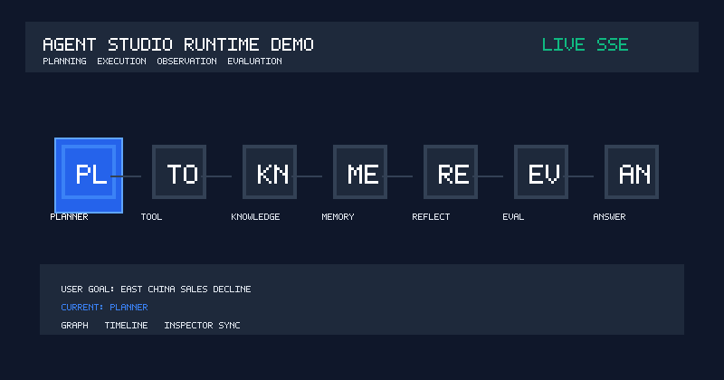
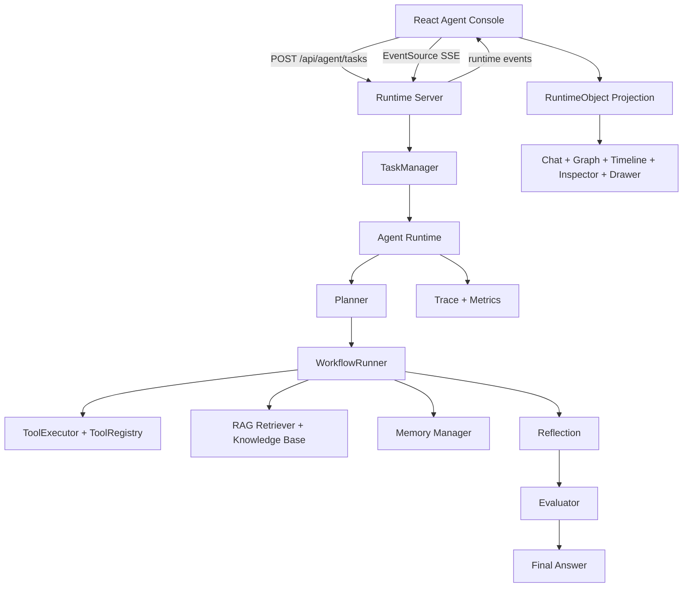
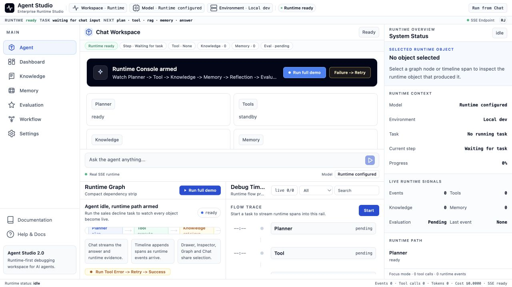
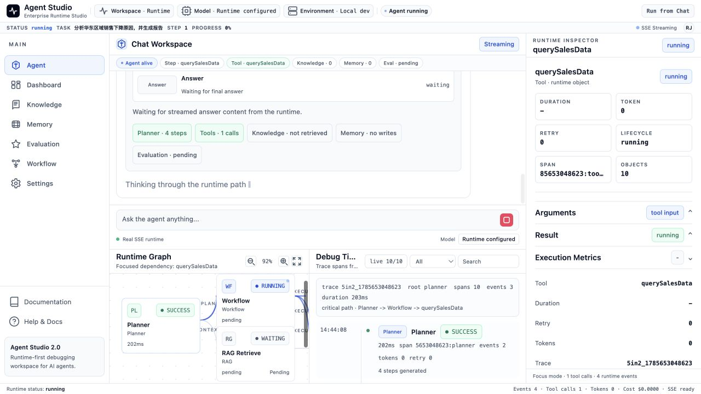
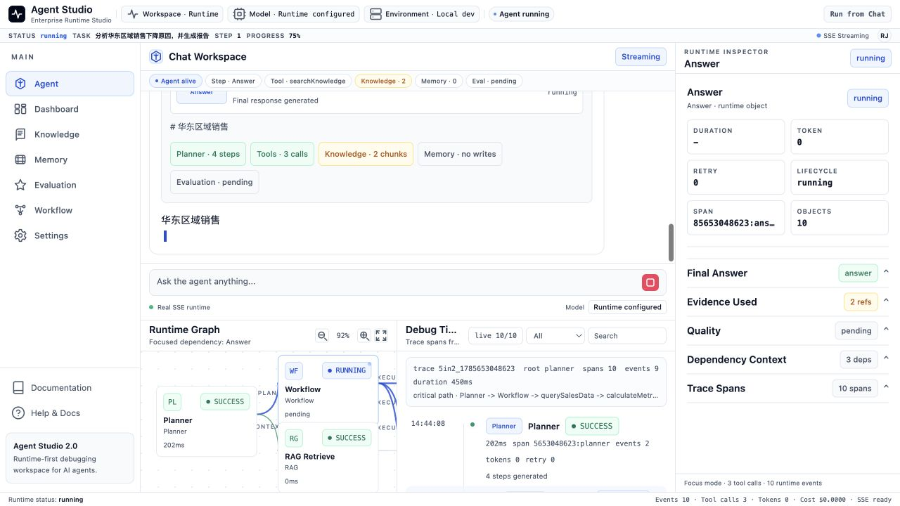
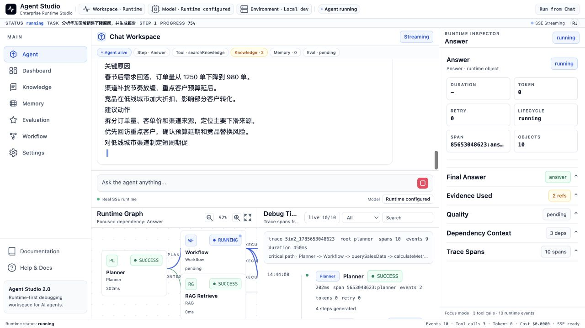
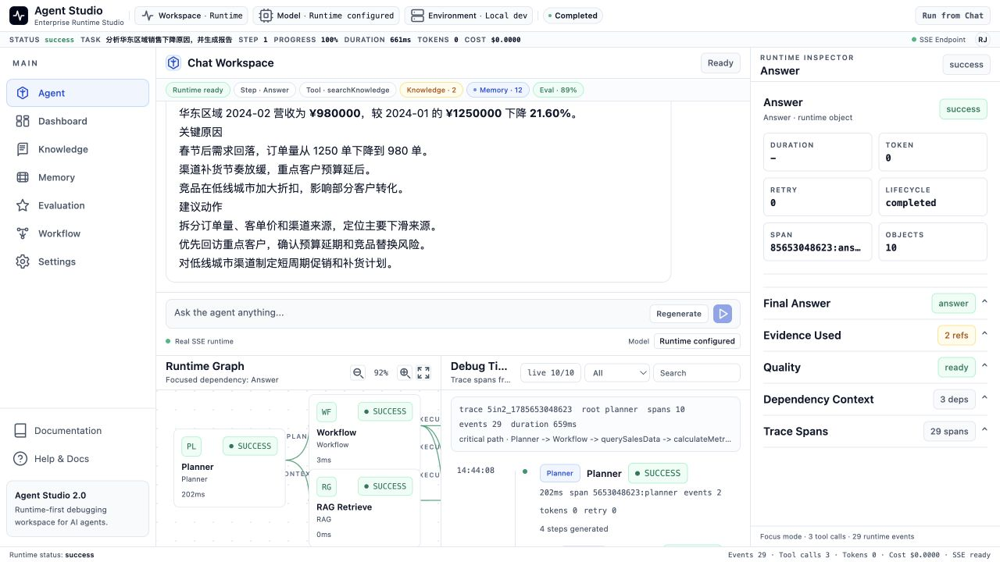
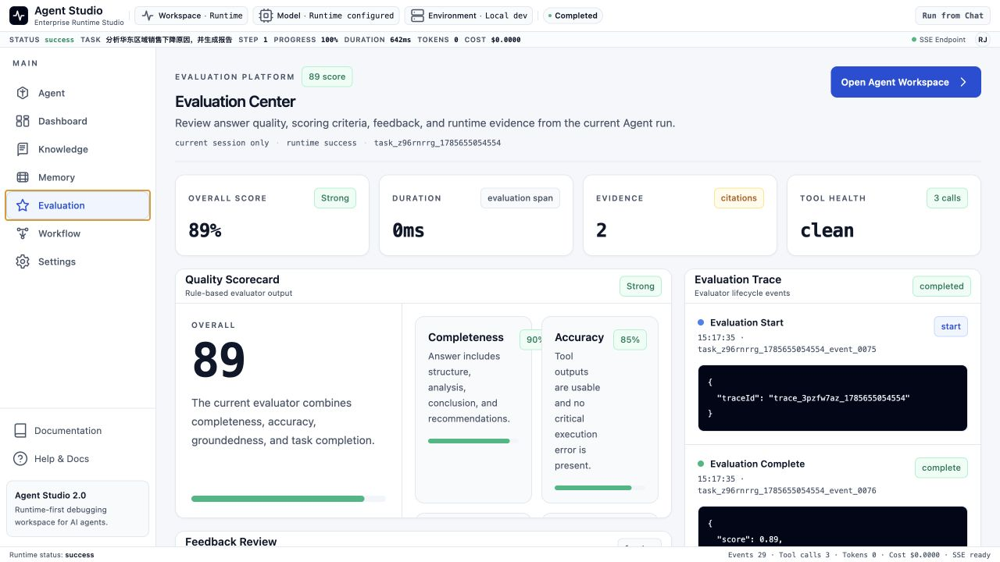

# Agent Studio

AI Agent Runtime Studio for planning, execution, observation, memory, retrieval, reflection, and evaluation.

This is a portfolio project for AI Agent Platform / AI Agent full-stack interviews. It is not a ChatGPT clone, not a dashboard template, and not a fake SaaS shell. The core goal is to make an interviewer believe the candidate understands how an Agent Runtime is built, streamed, inspected, and explained.



## Project Introduction

Agent Studio turns a running AI agent into an IDE-like runtime console.

The main demo starts with:

```text
分析华东区域销售下降原因，并生成报告
```

The runtime then moves through:

```text
Planning -> Tool Call -> Knowledge Retrieval -> Memory Update -> Reflection -> Evaluation -> Final Answer
```

The `/agent` page is the product center. Chat is the primary workspace. Graph explains runtime dependency. Timeline debugs event flow. Inspector and Drawer explain the selected RuntimeObject.

## Features

- **Agent Runtime lifecycle**: Planner, WorkflowRunner, ToolExecutor, RAG, Memory, Reflection, Evaluation, and Final Answer.
- **Real Runtime Server**: task creation, task query, cancel, retry, and SSE event streaming.
- **RuntimeObject model**: one projected object model shared by Chat, Graph, Timeline, Inspector, Drawer, Evidence, Memory, and Evaluation.
- **Execution Graph**: compact dependency graph for Planner, Workflow, Tool, Knowledge, Memory, Reflection, Evaluation, and Answer.
- **Debug Timeline**: runtime spans with component, status, duration, retry, token, metadata, input, and output.
- **Professional Inspector**: object-driven panels for execution, input, output, reasoning, trace, evidence, memory, evaluation, and logs.
- **Portfolio demo path**: one-click demo task plus failure recovery demo for Tool Error -> Retry -> Reflection -> Success.

## Architecture



## Runtime Flow

```text
User Goal
  -> createAgentTask(input)
  -> Runtime Server creates task
  -> Agent Runtime emits events
  -> SSE streams AgentServerEvent
  -> Zustand updates session state
  -> RuntimeObject projection
  -> Chat / Graph / Timeline / Inspector / Drawer synchronize
```

Supported events include:

```text
task_created
plan_start
plan_update
tool_start
tool_success
tool_error
task_retry
rag_retrieve
memory_update
reflection
evaluation_start
evaluation_complete
state_update
final_answer
task_complete
```

## Screenshots

All screenshots are captured from the local demo task:

```text
分析华东区域销售下降原因，并生成报告
```

| Stage | What It Shows | Screenshot |
| --- | --- | --- |
| Idle Runtime Console | Before the task starts: ready state, quick demo entry, runtime path, and inspector overview. |  |
| Running Agent Task | The sales decline task is active and the console is following the current runtime object. |  |
| Tool Call | ToolExecutor calls sales-data and metric tools, while Chat, Graph, Timeline, and Inspector update together. |  |
| Knowledge Retrieval | RAG retrieves evidence for East China sales decline causes and exposes source chunks. |  |
| Debug Timeline | Timeline shows runtime spans, duration, component, status, retry, token, and trace context. |  |
| Runtime Inspector | Final Answer object selected: inspector explains output, evidence, dependency context, and trace spans. |  |
| Evaluation | Evaluation Center shows score, criteria, feedback, and quality review for the completed sales task. |  |

## Tech Stack

| Layer | Technology |
| --- | --- |
| Frontend | React, TypeScript, Vite, React Router |
| State | Zustand |
| UI | Tailwind CSS, Framer Motion, local design tokens |
| Server | Node.js HTTP server, TypeScript |
| Streaming | Server-Sent Events |
| Runtime | Planner, WorkflowRunner, ToolExecutor, RAG, Memory, Reflection, Evaluation |
| Shared Contracts | TypeScript shared-types package |

## Folder Structure

```text
apps/
├── agent-console/
│   └── src/
│       ├── components/
│       ├── features/agent-console/
│       ├── hooks/
│       ├── layout/
│       ├── pages/
│       ├── router/
│       ├── services/
│       ├── store/
│       ├── theme/
│       └── types/
└── runtime-server/
    └── src/
        ├── runtime/
        ├── sse/
        └── task/

packages/
├── agent-runtime/
│   └── src/
│       ├── agent/
│       ├── evaluation/
│       ├── llm/
│       ├── memory/
│       ├── observability/
│       ├── planner/
│       ├── rag/
│       ├── tool/
│       └── workflow/
├── shared-types/
└── shared-utils/

docs/
├── PRODUCT.md
├── DESIGN.md
├── UX.md
├── DESIGN_SYSTEM.md
├── ARCHITECTURE.md
├── ROADMAP.md
├── DEMO_SCRIPT.md
├── screenshots/
└── media/
```

## Quick Start

Install dependencies:

```bash
npm install
```

Start the Runtime Server:

```bash
npm run server
```

Start the React Console in another terminal:

```bash
npm --prefix apps/agent-console run dev
```

Open:

```text
http://127.0.0.1:5173/agent
```

Frontend environment:

```text
apps/agent-console/.env
VITE_AGENT_SERVER_URL=http://127.0.0.1:3001
```

## Demo

Primary demo task:

```text
分析华东区域销售下降原因，并生成报告
```

Expected demo sequence:

```text
1. Chat receives the business goal.
2. Planner creates executable steps.
3. ToolExecutor queries sales data and calculates metrics.
4. RAG retrieves relevant knowledge chunks.
5. Memory stores working / episodic / semantic context.
6. Reflection checks whether the answer is complete.
7. Evaluation scores completeness, accuracy, groundedness, and task completion.
8. Final Answer streams into Chat as Markdown.
9. Graph, Timeline, Inspector, Drawer, Evidence, Memory, and Evaluation stay synchronized.
```

Demo scripts:

- [3-minute recruiter demo](docs/DEMO_SCRIPT.md#3-minute-demo)
- [10-minute technical walkthrough](docs/DEMO_SCRIPT.md#10-minute-demo)
- [30-minute deep dive](docs/DEMO_SCRIPT.md#30-minute-demo)

## Verification

```bash
npm run lint
npm run test
npm run build
```

Note: in restricted sandbox environments, `tsx` and Vite may fail with local IPC or port-listening errors such as `listen EPERM ... tsx-501/*.pipe`. Run the same commands in a normal local terminal for final verification.

## What Is Real Today

Implemented:

- TypeScript Agent Runtime
- Planner and PlanValidator
- WorkflowRunner
- ToolRegistry and ToolExecutor
- RAG retrieval over a local knowledge base
- Working / Episodic / Semantic memory model
- Reflection
- Evaluation
- Observability primitives
- Runtime Server with task lifecycle
- SSE event streaming
- Task cancel and retry
- React Runtime Studio
- RuntimeObject projection for Graph / Timeline / Inspector / Drawer
- Dashboard, Knowledge, Memory, Evaluation, Workflow, and Settings pages for portfolio demonstration

Not implemented intentionally:

- persistent vector database
- document upload pipeline
- persistent memory database
- historical evaluation datasets
- editable workflow deployment
- RBAC / SSO / audit logs
- secret management
- billing or team administration

These are roadmap items, not fake UI claims.

## Interview Narrative

This project demonstrates:

- **Frontend ability**: React architecture, TypeScript, Zustand, SSE, design system, runtime workspace, graph, timeline, inspector, drawer, and interaction design.
- **Agent ability**: Planner, workflow execution, tool runtime, RAG, memory, reflection, evaluation, trace, and runtime events.
- **Backend ability**: task lifecycle, EventSource stream, Runtime Adapter, TaskManager, cancel/retry, and shared API contracts.
- **Product judgment**: runtime-first IA, honest boundaries, demo flow, and documentation that can be explained in interviews.

The project is optimized for one outcome: helping a candidate explain and demonstrate AI Agent Platform engineering ability.
